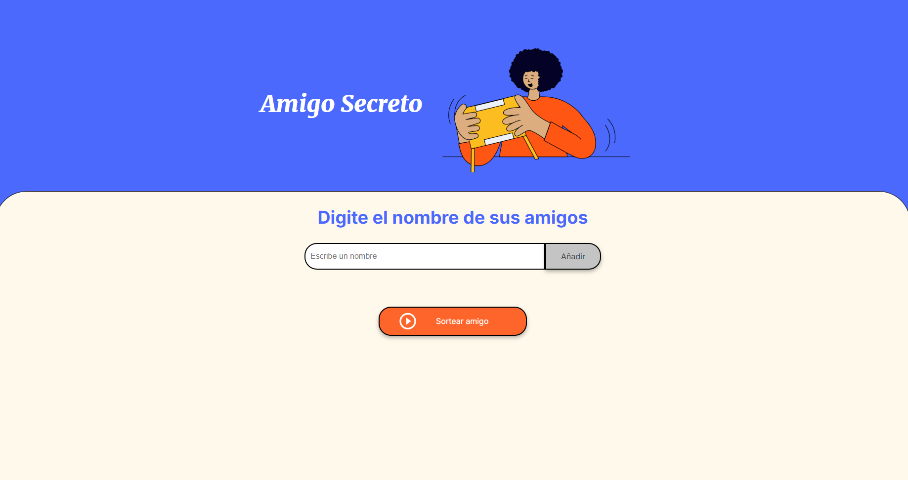

# 🎁 Amigo Secreto - Sorteo Aleatorio 🎉

## 📌 Descripción

Este proyecto es una aplicación web sencilla que permite a los usuarios agregar nombres de amigos y realizar un **sorteo aleatorio** para determinar quién será el **"amigo secreto"**. La aplicación está construida con **HTML, CSS y JavaScript** y no requiere backend, ya que toda la lógica funciona en el navegador.

---

## 🛠️ Funcionalidades

✅ **Agregar nombres**: Los usuarios pueden ingresar nombres en un campo de texto y agregarlos a una lista.  
✅ **Validación de entrada**: Se muestra una alerta si el campo está vacío o si el nombre ya está en la lista.  
✅ **Visualizar la lista**: Los nombres ingresados se muestran en una lista en la página.  
✅ **Eliminar nombres**: Cada nombre agregado tiene un botón ❌ para eliminarlo de la lista.  
✅ **Sortear aleatoriamente**: Al presionar el botón "Sortear amigo", se elige un nombre de la lista de forma aleatoria.  
✅ **Mostrar el resultado**: El nombre sorteado se muestra en pantalla con un mensaje animado.  

---

## 📷 Captura de Pantalla

 *(Puedes agregar una imagen de tu aplicación aquí)*

---

## 🚀 Tecnologías Utilizadas

- **HTML5** → Estructura de la página
- **CSS3** → Estilos y diseño responsivo
- **JavaScript (ES6)** → Lógica de la aplicación (manejo de nombres y sorteo aleatorio)

---

## 🏗️ Instalación y Uso

1. **Clona el repositorio** en tu computadora:
   ```bash
   git clone https://github.com/tuusuario/amigo-secreto.git
   ```
2. **Abre el archivo `index.html`** en tu navegador favorito.  
3. **¡Comienza a jugar!** Agrega nombres y realiza el sorteo.

---

## 📄 Estructura del Proyecto

```
📂 amigo-secreto/
│── 📂 assets/             # Imágenes e íconos
│── 📄 index.html          # Página principal
│── 📄 style.css           # Estilos de la aplicación
│── 📄 app.js              # Lógica en JavaScript
│── 📄 README.md           # Documentación del proyecto
```

---

## ✨ Mejoras Futuras

🔹 Agregar opción para reiniciar el sorteo.  
🔹 Permitir que los participantes no puedan asignarse a sí mismos.  
🔹 Implementar una versión con almacenamiento en **LocalStorage** para guardar los nombres.  
🔹 Agregar animaciones más dinámicas con **CSS o JavaScript**.  

---

## 🤝 Contribuciones

Si deseas contribuir a este proyecto, ¡eres bienvenido! Puedes hacer un **fork**, mejorar el código y enviar un **pull request**.  

---

## 📜 Licencia

Este proyecto está bajo la licencia **MIT**. Puedes usarlo, modificarlo y compartirlo libremente.  

📧 **Contacto:** Si tienes alguna sugerencia o pregunta, ¡contáctame en [tuemail@ejemplo.com](cloudingfreeone@gmail.com)! 😊

---

🎉 ¡Gracias por visitar este proyecto! ¡Diviértete sorteando tu Amigo Secreto! 🥳
